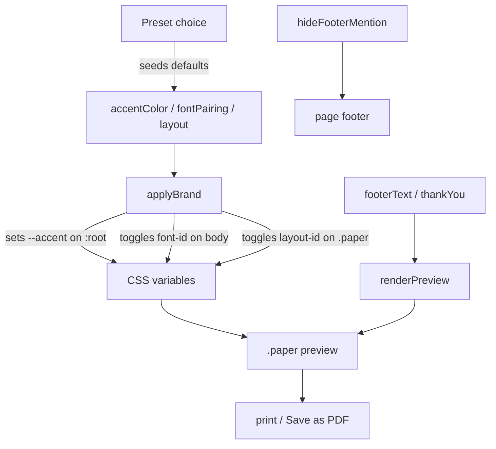

# feat: Brand Kit — white-label branding for SwiftInvo invoices

## Summary

Add a per-business **Brand Kit** to SwiftInvo so each freelancer's invoices carry their own visual identity instead of the shared default. A freelancer picks one of three presets (which set a layout, font pairing, and default accent color in one action), then optionally overrides the accent color, font pairing, layout, and footer / thank-you text. The brand is saved with the business profile, applied to every invoice and its PDF, and included in backups.

## Problem Frame

Today every SwiftInvo invoice renders with one fixed identity — a single ink-indigo accent, the Fraunces/Inter type pairing, and one layout. A freelancer can add a logo and contact details, but two unrelated users still send near-identical-looking documents. For a tool meant as a shared free resource, that sameness caps how personal and professional each user's invoices can feel. The accent color is also barely present on the paper today (only the tally-mark slash uses `--accent`; rule lines and the totals divider use `--ink`), so even the existing color carries little brand signal. (see origin: docs/brainstorms/2026-06-16-brand-kit-requirements.md)

---

## Requirements

**Brand controls**

- R1. A freelancer can choose a preset look from three curated presets — "Ledger" (current), "Mono Studio", "Bold Modern". Selecting a preset sets layout, font pairing, and default accent color in one action.
- R2. A freelancer can set a brand accent color, overriding the preset default. The accent recolors the non-semantic accent treatments on the paper: the table header rule, the totals divider, the "Total due" box, and the tally mark.
- R3. A freelancer can choose a font pairing from three curated pairings, overriding the preset default.
- R4. A freelancer can choose an invoice layout from two layouts (current "Ledger" and a bold-header variant), overriding the preset default.
- R5. A freelancer can set custom footer text and a custom thank-you line that replace the defaults on the invoice.
- R6. A freelancer can toggle off the SwiftInvo mention in the web page footer (the on-screen app chrome, not the printed invoice).

**Persistence and application**

- R7. Brand Kit choices are saved per business alongside the existing profile and persist across sessions.
- R8. Brand Kit choices apply automatically to the live preview and every invoice without per-invoice setup.
- R9. The chosen accent color (and any preset background tints) render correctly in the exported PDF — colors are not dropped by the browser print path.
- R10. Brand Kit settings are included in the backup export and restored on import.

**Quality floor**

- R11. Any combination of preset, accent color, font pairing, and layout produces a legible, non-broken invoice.
- R12. With no Brand Kit set, invoices render exactly as they do today — the current look is the implicit "Ledger" baseline.

---

## Key Technical Decisions

- **Brand state lives on the existing `profile` object, not a new store.** The brand is per-business and `profile` already persists to `swiftinvo.profile` and is already included in the backup export. New fields: `preset`, `accentColor`, `fontPairing`, `layout`, `footerText`, `thankYou`, `hideFooterMention`. This makes R7 and R10 fall out of existing persistence with only default-seeding on load.
- **Curated sets are static data tables, not user-defined.** `PRESETS`, `FONT_PAIRINGS`, and `LAYOUTS` are declared as constants near `CURRENCIES`. Each preset references a font-pairing id, a layout id, and a default accent hex. This keeps the option space bounded (offline-friendly, always coherent) per the brainstorm's curated-not-arbitrary decision.
- **Application is one `applyBrand()` function driven by CSS variables and class toggles.** Accent override sets the `--accent` custom property on `:root`; font pairing and layout toggle classes on `<body>` (`font-<id>`) and the `.paper` element (`layout-<id>`). The paper already reads design tokens from `:root`, so most recoloring follows from re-pointing `--accent` plus widening which paper elements consume it.
- **The status stamp stays semantic.** The paid=green / overdue=red ink stamp keeps `--paid` / `--over` and is deliberately excluded from accent recoloring — brand-coloring it would erase the status signal. This narrows R2's "ink stamp" wording from the origin; recorded here as the resolved decision.
- **Font pairings load up front, not lazily.** All curated families are added to the existing Google Fonts `<link>` so any pairing renders instantly and works offline once cached. The cost is a slightly heavier first load; the carrying cost of lazy per-pairing loading isn't justified for ~5 families.
- **"Modified preset" is derived, not stored.** A preset is shown as the active selection; if the current accent/font/layout no longer matches that preset's defaults, the UI shows a "modified" hint. No separate stored flag — derive by comparison so it can't drift from the actual values.
- **Print color fidelity via `print-color-adjust`.** The `@media print` block adds `print-color-adjust: exact` (and `-webkit-` prefix) to the paper so the brand accent and any background tints survive Save-as-PDF (R9).

---

## High-Level Technical Design

Brand is a single source of truth fanning out to the rendered paper and the PDF. A preset selection seeds the three independent controls; the controls feed `applyBrand()`; `applyBrand()` drives CSS variables and class toggles that the existing preview and print paths already consume.

Override semantics: selecting a preset overwrites the three control values with that preset's defaults; changing any single control afterward leaves the others intact and flips the derived "modified" state.

---

## Implementation Units

### U1. Brand data model, curated sets, and persistence defaults

- **Goal:** Establish brand state on `profile` and the static curated option tables, with safe defaults so existing/backup-restored profiles gain brand fields without breaking.
- **Requirements:** R1, R7, R10, R12
- **Dependencies:** none
- **Files:** `index.html`
- **Approach:** Declare `PRESETS`, `FONT_PAIRINGS`, `LAYOUTS` constants near `CURRENCIES`. Each preset: `{id, label, fontPairing, layout, accent}`. Each font pairing: `{id, label, serif, sans, mono}` mapping to CSS family stacks. Each layout: `{id, label}`. Extend the `profile` default object (and the `load(K.profile, …)` fallback) with `preset:"ledger"`, `accentColor:"#3a36b8"`, `fontPairing:"classic"`, `layout:"ledger"`, `footerText:""`, `thankYou:""`, `hideFooterMention:false`. Seed missing fields on load so older profiles and imported backups default to the current look (R12). No change needed to `exportData`/`importData` — they already serialize the whole `profile`.
- **Patterns to follow:** the existing `CURRENCIES` constant and the `profile = load(K.profile, {…})` default-object pattern.
- **Test scenarios:**
  - Covers R12. Load app with a pre-existing profile that has no brand fields → brand fields populate with Ledger defaults; invoice looks unchanged.
  - Covers R10. Export a backup after setting brand fields, clear storage, import it → brand fields restore intact.
  - Fresh profile (no stored profile) → defaults applied, no console errors.
- **Verification:** `profile` always has all seven brand fields after load regardless of stored shape; backup round-trip preserves them.

### U2. Brand CSS — font-pairing classes, layout themes, accent routing, print fidelity

- **Goal:** Add the CSS that makes brand state visible: font-pairing classes, layout variants, accent-driven paper elements, and print color preservation.
- **Requirements:** R2, R4, R9, R11
- **Dependencies:** U1
- **Files:** `index.html`
- **Approach:** Add the curated font families to the Google Fonts `<link>`. Define `body.font-<id>` rules that set `--serif`/`--sans`/`--mono`. Define `.paper.layout-<id>` rules for the bold-header variant (e.g., larger/filled `.doc-word` band, restyled `.paper-head`). Re-point the brandable paper accents to `var(--accent)`: `.ptable thead th` bottom border, `.ptot.g` top border, the "Total due" box (`.bill-totalbox`), and confirm the tally `.slash` already uses `--accent`. Leave `.stamp.paid` / `.stamp.over` on their semantic colors. In `@media print`, add `print-color-adjust: exact;` and `-webkit-print-color-adjust: exact;` to `.paper`.
- **Patterns to follow:** existing `:root` token usage, the `.paper`/`.ptable` selectors, the existing `@media print` block.
- **Test scenarios:**
  - Covers R2, R9. Set accent to a brand green → table header rule, totals divider, Total-due box, and tally mark turn green in preview AND in Save-as-PDF output.
  - Covers R4. Switch to bold-header layout → header band restyles; switch back → reverts cleanly with no leftover styles.
  - Covers R11. Try each font pairing × each layout × a light and a dark accent → invoice stays legible, no overflow or unreadable contrast on the paper.
  - Stamp check: an overdue invoice with a green brand accent → stamp stays red, accent elements stay green.
- **Verification:** every brandable element recolors with `--accent`; stamp never does; PDF retains colors.

### U3. `applyBrand()` engine and wiring into render/init

- **Goal:** Translate brand state into the DOM — set `--accent`, toggle font/layout classes — and call it everywhere the invoice renders.
- **Requirements:** R3, R8
- **Dependencies:** U1, U2
- **Files:** `index.html`
- **Approach:** Add `applyBrand()` that reads the seven `profile` brand fields, sets `document.documentElement.style.setProperty('--accent', profile.accentColor)`, and sets `<body>` class `font-<fontPairing>` and `.paper` class `layout-<layout>` (replacing any prior `font-`/`layout-` class). Call `applyBrand()` from `init()` and from `renderAll()` so loading/duplicating an invoice and changing brand both reflect immediately (R8). Add a small helper to compute the derived "modified preset" boolean by comparing current accent/font/layout against the active preset's defaults (consumed by U4).
- **Patterns to follow:** the existing `renderAll()` / `init()` orchestration and `setMobileTab()` class-toggling style.
- **Test scenarios:**
  - Covers R8. Change accent in settings → live preview updates without reload; start a new invoice → still branded.
  - Covers R3. Select a font pairing → body font classes swap and preview type changes.
  - Load a saved invoice → brand still applies (brand is per-business, not stored per-invoice).
- **Verification:** brand state always matches rendered DOM after `init` and after any brand change.

### U4. Brand Kit panel in the settings drawer

- **Goal:** Give freelancers the controls — preset picker, accent color, font pairing, layout, with a "modified" hint — inside the existing business drawer.
- **Requirements:** R1, R2, R3, R4, R7, R11
- **Dependencies:** U1, U2, U3
- **Files:** `index.html`
- **Approach:** Extend `renderSettings()` with a "Brand Kit" block above or below the business fields: a row of preset choices (label + accent swatch), a color `<input type="color">` bound to `accentColor`, a `<select>` for font pairing, a `<select>` for layout, and a derived "Modified from <preset>" hint when applicable. Selecting a preset writes its three defaults into `profile` and re-renders the panel; changing an individual control writes just that field. Each change calls `applyBrand()` + `renderPreview()` for live feedback, and persists on the existing "Save business details" action (`save(K.profile, profile)`). Reuse the existing logo upload row already in this function.
- **Patterns to follow:** the current `renderSettings()` drawer markup, the `.seg` segmented control, `.select`/`.input` styles, and the `saveProfile` handler.
- **Test scenarios:**
  - Covers R1. Pick "Bold Modern" → accent, font, layout all change together; preview reflects it; reopen drawer shows Bold Modern selected.
  - Covers AE3. Pick a preset then change only the font → reopen drawer shows the preset still selected with a "modified" hint, font override retained (not reset).
  - Covers R7. Set brand, close drawer, reload page → brand persists.
  - Color input reflects the active accent on open (not a stale default).
- **Verification:** all four controls round-trip through `profile` and persist; modified hint matches actual values.

### U5. Footer text, thank-you line, and app-footer mention toggle

- **Goal:** Wire the text-branding controls into the invoice preview and the page footer toggle.
- **Requirements:** R5, R6, R8
- **Dependencies:** U1, U3, U4
- **Files:** `index.html`
- **Approach:** Add inputs for `footerText` and `thankYou` to the Brand Kit panel (U4) and a toggle for `hideFooterMention`. In `renderPreview()`, use `profile.thankYou` for the `.thanks` line when set (else the current default) and render `profile.footerText` in the notes/footer area of the paper when set. Apply `hideFooterMention` by toggling visibility of the SwiftInvo sentence in the page `.foot-note` (keep the Export/Import links). The printed invoice is unaffected by the toggle since it never carried the SwiftInvo mention.
- **Patterns to follow:** the `.thanks` rendering in `renderPreview()`, the existing notes rendering, and the `.foot-note` markup.
- **Test scenarios:**
  - Covers R5. Set custom thank-you + footer text → both appear on the paper and in the PDF; clearing them restores defaults.
  - Covers AE4 / R6. Toggle off the SwiftInvo mention → page footer drops the SwiftInvo sentence, Export/Import links remain, printed invoice unchanged.
  - Covers R8. Change footer text → live preview updates immediately.
- **Verification:** text controls reflect live in preview and PDF; footer toggle affects only the page chrome.

---

## Acceptance Examples

These carry forward from the origin (see origin: docs/brainstorms/2026-06-16-brand-kit-requirements.md) and are verified by the manual test scenarios above (no automated harness exists in this project).

- AE1. **Covers R1, R8.** No branding set; select "Bold Modern" → live preview re-renders with that preset's layout, fonts, and accent, and the next new invoice opens already branded.
- AE2. **Covers R2, R9.** Set accent to brand green; download PDF → rule lines, totals divider, Total-due box, and tally mark are green in the saved PDF. (Stamp stays semantic.)
- AE3. **Covers R1, R3, R4.** Select a preset, then change only the font pairing → reopening the Brand Kit still shows the preset as the starting point with the font override applied (modified state), not silently reset.
- AE4. **Covers R6.** Toggle off the SwiftInvo footer mention → web page footer no longer shows the SwiftInvo line; the printed invoice is unchanged (it never carried it).
- AE5. **Covers R12.** A freelancer who never opens the Brand Kit → invoices render identically to the pre-feature default.

---

## Scope Boundaries

- Per-invoice branding overrides — brand is per-business, set once.
- Multiple saved brand profiles — one freelancer, one brand.
- Arbitrary font uploads or a free font picker — curated pairings only.
- Full multi-color palettes (separate header/body/background colors) — single accent only.
- Removing SwiftInvo branding from the printed invoice/PDF — it carries none.

### Deferred to Follow-Up Work

- More presets, layouts, or font pairings beyond the v1 set of 3/2/3.
- A reset-to-preset-defaults button (the "modified" state is shown but not one-click revertible in v1).

---

## Risks & Dependencies

- **Google Fonts dependency.** Added font pairings rely on the existing Google Fonts `<link>`. Offline-first works only after first cache; this matches the current behavior (fonts already load this way), so no regression — but worth noting the extra families increase first-load weight.
- **Print color fidelity is browser-dependent.** `print-color-adjust: exact` is honored by Chromium and Firefox; users must still keep "Background graphics" enabled in some print dialogs for background tints. Accent on borders/text is reliable; preset background tints are the at-risk part — keep tints subtle.
- **Single-file growth.** `index.html` grows with curated CSS for layouts/fonts. Acceptable for v1; a build step is out of scope.

---

## Open Questions

Resolved during planning (the brainstorm's deferred items):

- v1 set sized at 3 presets / 3 font pairings / 2 layouts (confirmed with user).
- Accent applies to the table header rule, totals divider, Total-due box, and tally mark; the status stamp stays semantic (confirmed with user).
- "Modified preset" is a derived hint, not a stored flag (KTD).

No blocking questions remain.

---

## Sources & Research

- Origin requirements: `docs/brainstorms/2026-06-16-brand-kit-requirements.md`.
- Implementation surface, all in `index.html`: the `:root` design tokens and `--accent` usage, `CURRENCIES` constant, `profile` object and `load`/`save` helpers, `renderSettings()`, `renderPreview()`, `renderAll()`, `init()`, `exportData`/`importData`, and the `@media print` block.
- No external research required — the feature builds on established CSS custom-property theming and the browser print path, both already used in the codebase.
